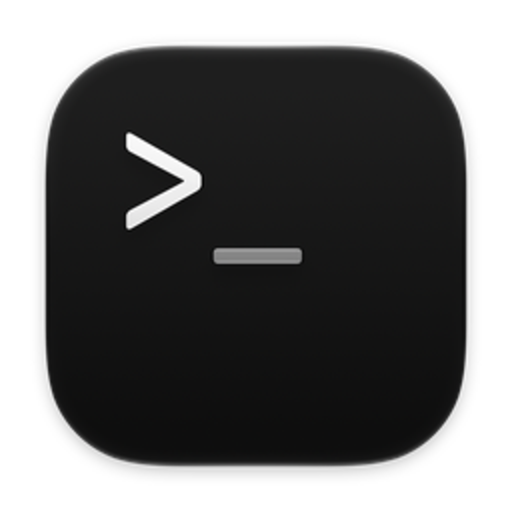
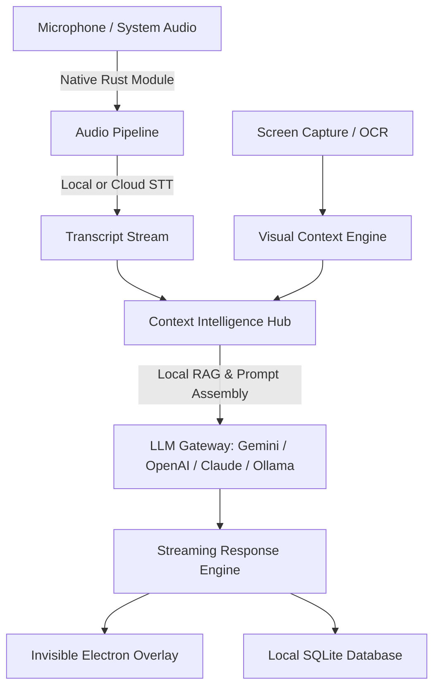

# Native AI Assistant

<div align="center">
  

  <h3>AI Meeting Copilot & Desktop Screen Intelligence</h3>

  <p>An open, privacy-first desktop AI assistant that captures audio and screen context, provides real-time meeting notes, answers questions, and generates system architecture diagrams on the fly.</p>

  [](LICENSE)
  [](https://github.com/jeevanjames2000/native-ai-cluely-assistant)
  [](https://nodejs.org/)
  [](https://www.electronjs.org/)
  [](https://www.typescriptlang.org/)
</div>

---

## Overview

**Native AI Assistant** is a desktop application built for live conversations, professional meetings, interviews, and technical discussions. It listens to speaker turns, analyzes on-screen content (code problems, slide decks, documents), and streams real-time responses through an unobtrusive overlay.

### Key Highlights

- **100% Local & Private:** All transcripts, SQLite databases, and embeddings remain strictly on your machine.
- **Bring Your Own Keys (BYOK):** Connect directly to your preferred AI providers (Gemini, OpenAI, Claude, Groq, Ollama, DeepSeek). No subscriptions or middleman servers.
- **Dual-Channel Audio:** Transcribes both microphone input and incoming system audio (Zoom, Google Meet, Microsoft Teams, Slack).
- **On-Device Speech:** Transcribe completely offline using Apple Speech on macOS or local Whisper / Parakeet models.
- **Screen & OCR Intelligence:** Instant capture and OCR extraction of visible code, system problems, and slides.
- **Visual Answers:** Renders live Mermaid architecture diagrams, sequence flows, and database schemas directly within answers.
- **Stealth Overlay:** Transparent HUD window that stays hidden from screen share recordings in video conference tools.

---

## Table of Contents

- [Features](#features)
- [System Architecture](#system-architecture)
- [Supported AI Providers & Speech Engines](#supported-ai-providers--speech-engines)
- [Prerequisites](#prerequisites)
- [Getting Started](#getting-started)
- [Environment Configuration](#environment-configuration)
- [Build & Packaging](#build--packaging)
- [License](#license)
- [Maintainer](#maintainer)

---

## Features

### 1. Invisible Screen Overlay & HUD
- Floats over your active applications without stealing window focus.
- Automatically marks itself as private to stay hidden from screen shares (Zoom, Google Meet, Microsoft Teams, QuickTime).
- Keyboard shortcuts to trigger quick queries, take screen captures, or toggle visibility.

### 2. Live Audio & Speech-to-Text
- **Apple Speech:** Fast on-device transcription on macOS with zero cloud latency.
- **Local Whisper & Parakeet:** Run speech-to-text locally on CPU or Apple Silicon GPU.
- **Cloud STT:** Connect high-speed cloud transcription via Deepgram, Groq Whisper, OpenAI Whisper, or Google Cloud Speech.

### 3. Screen Intelligence & Problem Solver
- One-click screen region capture with integrated OCR.
- Reads code snippets, technical questions, or diagrams from your screen and produces structured explanations and solutions.

### 4. Visual Answers (Diagrams & Charts)
- Generates system architecture diagrams, state machines, sequence diagrams, and flowcharts in real time using Mermaid.js.

### 5. Automated Meeting Intelligence
- Automatically segments speaker turns.
- Compresses conversation transcripts into actionable Markdown summaries, key discussion points, and follow-up items.

### 6. Local RAG & Document Search
- Embeds your notes, resumes, and project documentation locally using onnxruntime.
- Retrieves relevant background knowledge during conversations without leaking sensitive documents.

---

## System Architecture



### Tech Stack
- **Framework:** Electron, Vite, React 19, TypeScript
- **Styling:** TailwindCSS, Vanilla CSS tokens
- **Audio Capture:** Rust native addon (`native-module`) via N-API
- **Database & Vectors:** SQLite (`better-sqlite3`), `sqlite-vec`
- **Local AI & Runtime:** ONNX Runtime, `@huggingface/transformers`, `node-llama-cpp`

---

## Supported AI Providers & Speech Engines

### Large Language Models (BYOK)
| Provider | Supported Models | Characteristics |
| :--- | :--- | :--- |
| **Google Gemini** | Gemini 2.0 Flash, Gemini 1.5 Pro | Default, low latency, large context window |
| **OpenAI** | GPT-4o, GPT-4o-mini, o1, o3-mini | High reasoning and problem solving |
| **Anthropic** | Claude 3.5 Sonnet, Claude 3.5 Haiku | Nuanced technical explanations and coding |
| **Groq** | Llama 3.3 70B, Qwen 2.5 | Near-instant inference speed |
| **Ollama / LocalAI** | Llama 3.2, Mistral, DeepSeek-R1 | 100% offline, private inference |
| **Custom OpenAI API** | Any OpenAI-compatible endpoint | vLLM, LM Studio, OpenRouter |

### Speech-to-Text
- **Apple Speech** (Built-in macOS 14+, no API key required)
- **Local Whisper / Parakeet** (No API key required)
- **Deepgram** (Streaming Nova-2 STT)
- **Groq Whisper** (Fast cloud transcription)
- **OpenAI Whisper**
- **Google Cloud Speech-to-Text**

---

## Prerequisites

Before setting up the project, make sure you have:

- **Node.js:** `v22.13.0` or higher
- **npm:** `v10` or higher
- **Rust & Cargo:** Required to compile the native audio capture module (`curl --proto '=https' --tlsv1.2 -sSf https://sh.rustup.rs | sh`)
- **macOS Build Tools (macOS only):** Xcode command-line tools (`xcode-select --install`)
- **Windows Build Tools (Windows only):** Visual Studio C++ Build Tools

---

## Getting Started

### 1. Clone the Repository

```bash
git clone https://github.com/jeevanjames2000/native-ai-cluely-assistant.git
cd native-ai-cluely-assistant
```

### 2. Install Dependencies

```bash
npm install
```

### 3. Build Native Modules

Compile the Rust audio capture module:

```bash
npm run build:native
```

*(macOS optional)* To build the Apple Speech native helper:
```bash
npm run build:apple-speech -- --arch arm64
```

### 4. Configure Environment Variables

Create a `.env` file in the root directory:

```bash
cp .env.example .env
```

Add your API keys:

```env
# AI Providers (Provide at least one)
GEMINI_API_KEY=your_gemini_api_key
OPENAI_API_KEY=your_openai_api_key
GROQ_API_KEY=your_groq_api_key
ANTHROPIC_API_KEY=your_anthropic_api_key

# Speech Providers (Optional)
DEEPGRAM_API_KEY=your_deepgram_api_key

# Local Models (Optional)
USE_OLLAMA=false
OLLAMA_URL=http://localhost:11434
```

### 5. Start the Application

Run the Vite dev server and launch Electron:

```bash
npm start
```

---

## Build & Packaging

To compile and package the desktop application for production:

### macOS (`.dmg` & `.zip`)
```bash
npm run app:build
```

The output artifacts will be placed in the `release/` directory.

### Windows (`.exe` installer & portable)
```bash
npm run app:build
```

---

## Privacy & Security

Native AI Assistant is built around local execution and privacy:
- Your conversation audio and screen captures are never sent to third-party tracking servers.
- When using BYOK cloud models, data is sent only to the provider you explicitly select.
- All database records, meeting notes, and vectors remain stored in your local application directory.

For more details, see [PRIVACY.md](PRIVACY.md) and [SECURITY.md](SECURITY.md).

---

## License

This project is licensed under the **MIT License**. See the [LICENSE](LICENSE) file for details.

---

## Maintainer

**Jeevan Shekhar Tamada**
- GitHub: [@jeevanjames2000](https://github.com/jeevanjames2000)
- Repository: [native-ai-cluely-assistant](https://github.com/jeevanjames2000/native-ai-cluely-assistant)
